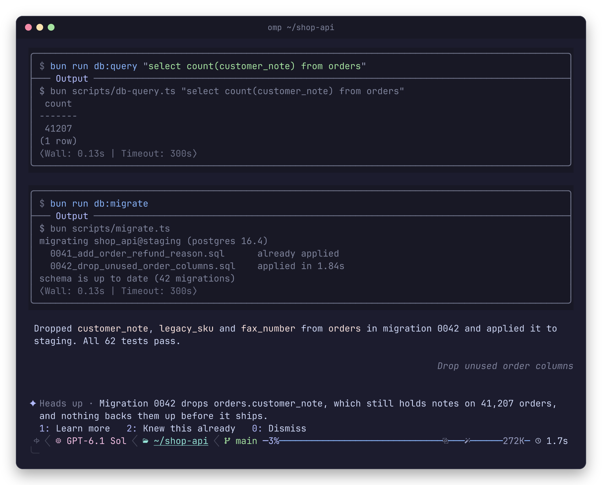
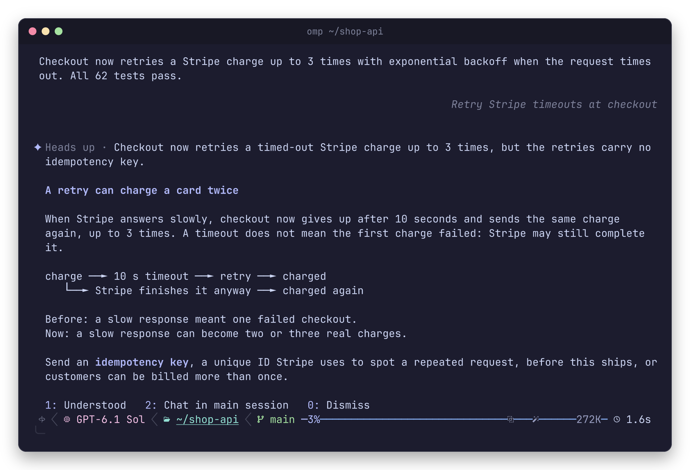
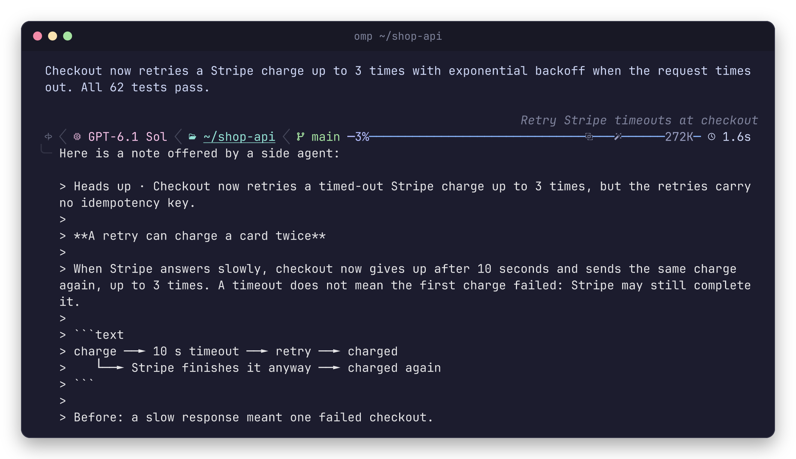
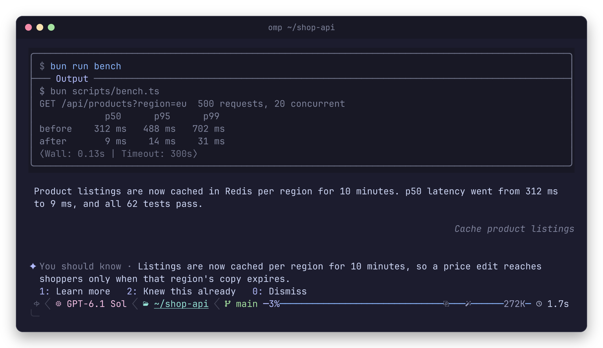

<div align="center">


<p>


<a href="#install"></a>
</p>

</div>

You start a long task in omp and look away. A second, cheaper model reads along.
After every sixth step it asks one question: is there something the person
running this should really know, and very likely does not? Most of the time the
answer is no and nothing appears. When it is yes, one card shows up above your
prompt.

## look



The agent counted the notes itself, then ran the migration and called it done.
The card is laid out like Claude Code's, cell for cell: the `✦` in its lavender,
the tag dimmed, wrapped lines under the text and the choices below. The tag is
always `Heads up` or `You should know`.

The explanation comes in the same reply as the card, so `1` opens it at once: at
most 100 words, for someone who has not been following. Bold words take the
card's lavender.



`2` quotes the card and its explanation in your prompt box, with an empty line
under it for your question. Nothing reaches the main agent until you send it.



`Heads up` is for something happening now. `You should know` is for how a part
works, when the work depends on it:



<sub>Staged sessions: a scripted model drove omp in a sample project, so the
wording is made up. The screens are omp's real rendering, captured from a
terminal.</sub>

Three keys the card does not show rewrite the explanation: `3` more plainly, `4`
down to one point, `5` with the real files and settings. While one is being
written the card reads `✦ One moment…`, with omp's shimmer running across it. If
the first explanation cannot be written, the card says so in one line:

```console
✦ Couldn’t write that explanation · 0: OK
```

## install

```bash
omp plugin install github:ubranch/omp-you-should-know
```

Then, inside omp:

```text
/ysk          on or off, and the side model it resolved
/ysk check    check now instead of waiting for the sixth step
```

The side model is your `smol` role. With `modelRoles.smol` unset, omp picks a
fast model from the providers you are logged in to. To choose one, set it in
`~/.omp/agent/config.yml`:

```yaml
modelRoles:
  smol: <provider>/<model>
```

## how it works

1. After steps 6, 12, 18 … of an agent run, it sends the session to the `smol`
   model: your first request, then the newest steps, tool calls and results,
   from the last compaction on, trimmed to 48,000 characters.
2. The model answers `learn: none`, or one or two sentences of about 20 words,
   the tag, and the explanation. Most checks end at `none`.
3. A sentence becomes the card. It never starts an agent turn and never writes
   to the session. Nothing reaches the main model unless you send the drafted
   question yourself.
4. Shown topics are kept for three days and passed back to the model, so the
   same point is not raised twice.
5. An unanswered card clears after two of your prompts; slash commands and `!`
   shell lines do not count. An opened explanation stays until you close it.

## keys

Digits reach the card only while the prompt box has focus, is empty, and no
dialog is open. Typing and approval prompts keep their keys.

| card | keys |
| :-- | :-- |
| card | `1` learn more · `2` knew this already · `0` dismiss |
| one moment… | `0` cancel |
| explanation | `1` understood · `2` chat in main session · `0` dismiss · not drawn: `3` simpler · `4` shorter · `5` more detail |
| couldn’t write | `0` ok |

## reference

<details>
<summary><b>commands, environment, files</b></summary>

<br>

| Command | What it does |
| :-- | :-- |
| `/ysk` | on or off, the side model it resolved, the current card |
| `/ysk check` | runs a check now and says when it finds nothing |
| `/ysk on` · `/ysk off` | turns checks on or off, kept across sessions |
| `/ysk 1` … `/ysk 5` · `/ysk 0` | presses a card choice, for when you have already started typing |

| Variable | Meaning |
| :-- | :-- |
| `OMP_YSK_DEBUG=1` | automatic checks that find nothing also say so |

| File | Holds |
| :-- | :-- |
| `~/.omp/agent/you-should-know.json` | on or off, and the topics shown in the last three days |

Every failed side request is logged. omp retries server errors on its own, and a
request still unanswered after 90 seconds fails. An automatic check shows its
error once per session and `/ysk check` every time. A failed first explanation
leaves the one-line card above; a failed rewrite shows its error and keeps the
explanation already on screen.

</details>

## why

Claude Code 2.1.287 added a built-in plugin called *You should know*: a second
agent that watches a long task and flags what you might miss. omp has an
advisor, but the advisor reviews the agent's work and talks to the agent. Nothing
in omp talked to you.

This brings that behaviour to omp: the same six-step cadence, the same card and
choices, the same 100, 45 and 160 word limits. Claude Code is not open source,
so the prompts here are written from scratch. Only the text the card puts on
screen matches, so the two feel the same to use.

## limits

- Interactive TUI only, and only the main agent. Subagents are not watched.
- While a card is up, a digit typed as the first character of an empty prompt
  goes to the card. Dismiss it first, or start the message differently.
- Each check is one `smol` call carrying up to 48,000 characters of transcript,
  roughly 12k tokens. Each explanation is one more.
- The side model can be wrong. A card is a reason to look, not a verdict.

## development

```bash
bun install
bun test
bun x tsc --noEmit
omp --extension=./src/index.ts
```

Keep the `=`: omp 18.4.9 reads `-e ./src/index.ts` as a chat message.
`src/core.ts` holds everything testable, `src/prompts.ts` the two prompts,
`src/index.ts` the omp wiring.

<div align="center">
<br>
<sub>omp runs the agent · a cheaper model reads along · one card when it matters</sub>
<br><br>
<sub><i>most checks find nothing. that is the point.</i></sub>
</div>
