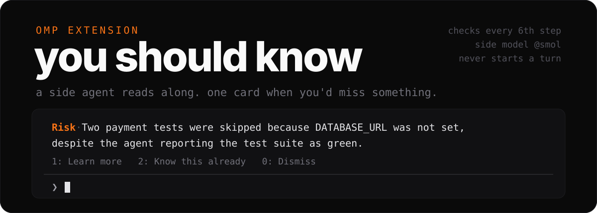

<div align="center">



<p>


<a href="#install"></a>
</p>

</div>

You start a long task in omp and look away. A second, cheaper model reads along.
After every sixth step it asks one question: is there something the person
running this should really know, and very likely does not? Most of the time the
answer is no and nothing appears. When it is yes, one card shows up above your
prompt.

## look

```console
 Tests skipped · Two payment tests were skipped because DATABASE_URL was not set,
 despite the agent reporting the run as green.
 1: Learn more   2: Know this already   0: Dismiss
────────────────────────────────────────────────────────────────────────────────
❯
```

In that session the agent had run `sh ./test.sh`, seen
`3 passed, 2 skipped, 0 failed`, and answered "Yes" when asked whether the tests
were green. A card on the same point had already come up on its own, at the
sixth step of a later run.

`1` asks the same side model to explain it in at most 100 words, for someone who
has not been following:

```text
 Payment tests were skipped
 When automated checks run, they need a database address to test money
 transactions. Because that address was missing, the suite bypassed checks like
 preventing double charges rather than verifying them.
 The agent reported the test run as green because 0 failed.
 In reality, only 3 passed while 2 were skipped.
   Ran:     [pass] [pass] [pass]
   Skipped: [DATABASE_URL unset] [DATABASE_URL unset]
 You risk releasing untested payment safeguards, so you must decide whether to
 set DATABASE_URL and run ./test.sh again before shipping.
 1: Understood   2: Chat in main session   3: Simpler   4: Shorter   5: More detail   0: Dismiss
```

`3` says it more plainly, `4` cuts it to one point, `5` names the real files and
settings. `2` puts a question about it in your prompt box for the main agent and
leaves it there for you to edit or send.

## install

```bash
omp plugin install github:ubranch/omp-you-should-know
```

Then, inside omp:

```text
/ysk          on or off, and the side model it resolved
/ysk check    check now instead of waiting for the sixth step
```

The side model is your `smol` role. With `modelRoles.smol` unset, omp picks a
fast model from the providers you are logged in to. To choose one, set it in
`~/.omp/agent/config.yml`:

```yaml
modelRoles:
  smol: <provider>/<model>
```

## how it works

1. After steps 6, 12, 18 … of an agent run, it sends the session to the `smol`
   model: your first request, then the newest steps, tool calls and results,
   from the last compaction on, trimmed to 48,000 characters.
2. The model answers `learn: none`, or one sentence of at most 25 words and a
   one-to-three-word tag such as `Risk` or `Cost`. Most checks end at `none`.
3. A sentence becomes the card. It never starts an agent turn and never writes
   to the session. Nothing reaches the main model unless you send the drafted
   question yourself.
4. Shown topics are kept for three days and passed back to the model, so the
   same point is not raised twice.
5. An unanswered card clears after two of your prompts. An opened explanation
   stays until you close it.

## keys

Digits reach the card only while the prompt box has focus, is empty, and no
dialog is open. Typing and approval prompts keep their keys.

| card | keys |
| :-- | :-- |
| heads-up | `1` learn more · `2` know this already · `0` dismiss |
| explaining | `0` cancel |
| explanation | `1` understood · `2` chat in main session · `3` simpler · `4` shorter · `5` more detail · `0` dismiss |

## reference

<details>
<summary><b>commands, environment, files</b></summary>

<br>

| Command | What it does |
| :-- | :-- |
| `/ysk` | on or off, the side model it resolved, the current card |
| `/ysk check` | runs a check now and says when it finds nothing |
| `/ysk on` · `/ysk off` | turns checks on or off, kept across sessions |
| `/ysk 1` … `/ysk 5` · `/ysk 0` | presses a card choice, for when you have already started typing |

| Variable | Meaning |
| :-- | :-- |
| `OMP_YSK_DEBUG=1` | automatic checks that find nothing also say so |

| File | Holds |
| :-- | :-- |
| `~/.omp/agent/you-should-know.json` | on or off, and the topics shown in the last three days |

Every failed side request is logged. An automatic check shows its error once per
session; `/ysk check` and explanations always show theirs.

</details>

## why

Claude Code 2.1.287 added a built-in plugin called *You should know*: a second
agent that watches a long task and flags what you might miss. omp has an
advisor, but the advisor reviews the agent's work and talks to the agent. Nothing
in omp talked to you.

This brings that behaviour to omp: the same six-step cadence, the same card and
choices, the same 100, 45 and 160 word limits. Claude Code is not open source,
so the prompts here are written from scratch. Only the card's button labels
match, so the two feel the same to use.

## limits

- Interactive TUI only, and only the main agent. Subagents are not watched.
- While a card is up, a digit typed as the first character of an empty prompt
  goes to the card. Dismiss it first, or start the message differently.
- Each check is one `smol` call carrying up to 48,000 characters of transcript,
  roughly 12k tokens. Each explanation is one more.
- The side model can be wrong. A card is a reason to look, not a verdict.

## development

```bash
bun install
bun test
bun x tsc --noEmit
omp --extension=./src/index.ts
```

Keep the `=`: omp 18.4.9 reads `-e ./src/index.ts` as a chat message.
`src/core.ts` holds everything testable, `src/prompts.ts` the two prompts,
`src/index.ts` the omp wiring.

<div align="center">
<br>
<sub>omp runs the agent · a cheaper model reads along · one card when it matters</sub>
<br><br>
<sub><i>most checks find nothing. that is the point.</i></sub>
</div>
